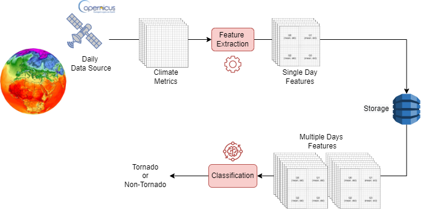
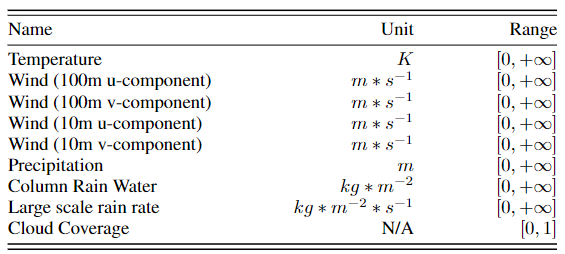
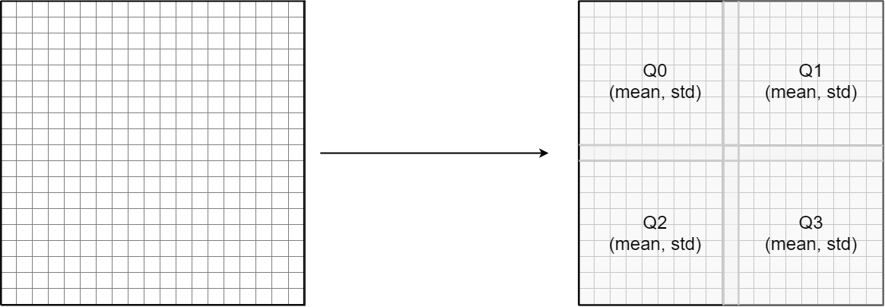
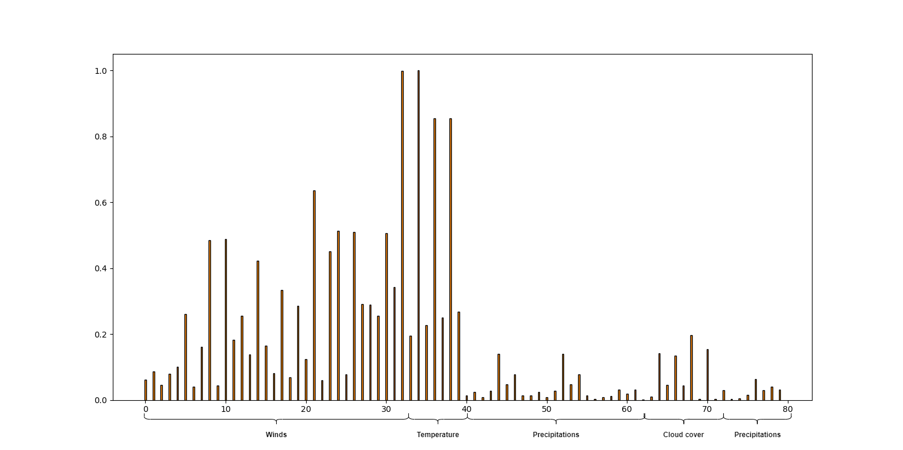
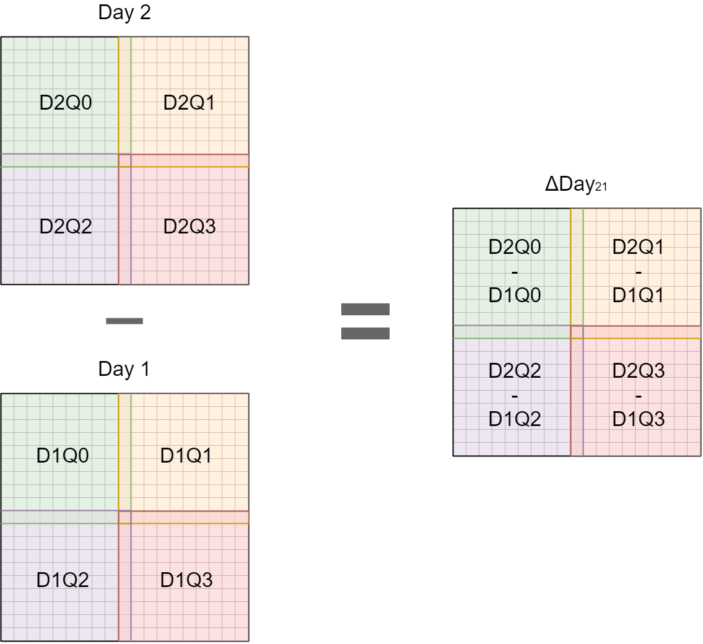

# Predicting Tornadoes days ahead with Machine Learning

This is the official repository of the paper "Predicting Tornadoes days ahead with Machine Learning" and is designed to allow other researchers to reproduce the results presented in the paper but also to exploit the dataset for their own experiments. Within this repository there are also a number of additional files used in the research phase to explore the effectiveness of various approaches.

## System Architecture

The early-detection tornado system presented in the research is visible in the above figure. It exploits meteorological data obtained from instrumentation which monitor vast geographical areas and extracting daily meteorological information from them. In order to make the proposed system as applicable as possible, the chosen data source consists of instrumental which are already widespread throughout
the world. In particular, we exploit as data source the instruments of Copernicus, an initiative of the European Space
Agency and the European Commission that makes publicly available the data collected by a series of satellites mon-
itoring the entire surface of the Earth. The data considered by our system are collected over a specific geographical
area which is represented by a grid.

For each cell of this grid, the meteorological information listed in the table are considered. These are meteorological
information that could play a role in tornadogenesis and have also been used in other previous work as shown in
Section 2. Each grid covers an area of 5 latitude/longitude degrees side. The considered area is deliberately very large
because the process of tornadogenesis can be influenced or triggered by large-scale meteorological phenomena and,
above all, to be able to predict their formation several days in advance, it is important to observe areas that are not
necessarily close to where the tornadogenesis will occur.
Subsequently, the grid is divided into four quadrants as shown in Figure 2 and within each quadrant the mean and
standard deviation of all the cells for each metric is calculated through a feature extraction mechanism. All values in
the grid are daily, while the calculated averages and standard deviations, from now on referred as features, are spatial.
Data are daily stored on a database and then the collected meteorological information of several days are used to obtain
the outcome from a Machine Learning classification model.
In order to achieve the earliest possible detection, the system is designed to estimate the tornadogenesis, considering
the meteorological metrics in a specific geographical area, up to five days before

## General Information
Python files are grouped in two folders:
- Preprocessing: containing all the Python files used for generating and manipulating the dataset;
- Classification: containing all the Python files used for training the Machine Learning models.

At the top of Python files are constants (file paths, thresholds, etc.) that can be modified to perform experiments.

## Preprocessing
The preprocessing folder contains all the Python files needed to generate and manipulate the dataset used in the paper. 
It is possible to expand the dataset or regenerate it from the two original datasets downloadable from:
- ERA5 (Meteorological data) -> https://www.ecmwf.int/en/forecasts/datasets/reanalysis-datasets/era5
- Storm Events Database (Tornadoes occurrences) -> https://www.ncdc.noaa.gov/stormevents/

After downloading the two datasets, to combine them and generate the final dataset used in the paper, you need to run the file preprocessing/data_collection.py.

The result of this operation (available in CSV and JSON format) can be directly downloaded by [clicking here](https://drive.google.com/drive/folders/1kiaY3LYekH3AumvOrYRCAF3arKSnQHMb?usp=sharing). The downloadable dataset contains events from 1990 to 2018, although only events up to 2017 were used for the experiments presented in the paper.

Then you can run the feature_extraction.py file to extract mean and variance in sub-quadrants as explained in the paper and shown in the figure.

The result of this operation is available in CSV format and can be directly downloaded by [clicking here](https://drive.google.com/drive/folders/1elEm8aYXGnEgsd3IoiPViZSquLygCRQt?usp=sharing).

### Additional experiments
Further experiments can be made from the original dataset by running the other files in the preprocessing folder:
- data_discretization: Applies various discretization techniques to data;
- data_extension: Extends the dataset by performing data augmentation by rotating the grids in various ways;
- data_normalization: Normalises the meteorological data in the dataset using the normalise function of scikit-learn;
- feature_selection: Performs an analysis of all metrics used in the dataset highlighting the most relevant ones. The resulting plot will be something like:

- days_evolution: Extracts more advanced features by performing the difference between the features of two consecutive days. The resulting dataset instead of having the metrics of each individual day will contain the differences between consecutive days (day 2 minus day 1, day 3 minus day 2 and so on). The result will be a dataset with data from only 4 days per event.

## Classification
The classification folder contains all the files needed to train the classifiers, use them and view their performance. In detail, it contains the following files:
- main_classifier: This file can be run to train all Machine Learning models considered in the research using only the 2017 events as a test and all others as training;
- main_ensemble (additional): It allows several classifiers to be trained and used in ensembles with the same subdivision as before;
- classifier.py (additional): It can be used to train classifiers without taking into account the time division used in the paper between testing and training;
- main_ensemble (additional): It can be used to train classifiers in ensembles without taking into account the time division used in the paper between testing and training;
- load_trained_classifier: Running it allows you to load and test a pre-trained model;

The trained models, including those obtained from additional experiments, can be downloaded by [clicking here](https://drive.google.com/drive/folders/1Via3bajHdy2XUsM6yUGHJqWjUuhp4nFr?usp=sharing). The classifiers are collected in folders named with the structure A_D_T, where A is the accuracy obtained on the test set by the classifier, D the considered training days (for example D12345, D123 etc) and T are the transformations applied to the dataset (for example 4Q for four quadrants transformation, D for discretization and so on). In each folder you can find the dataset splits used and the trained model.
